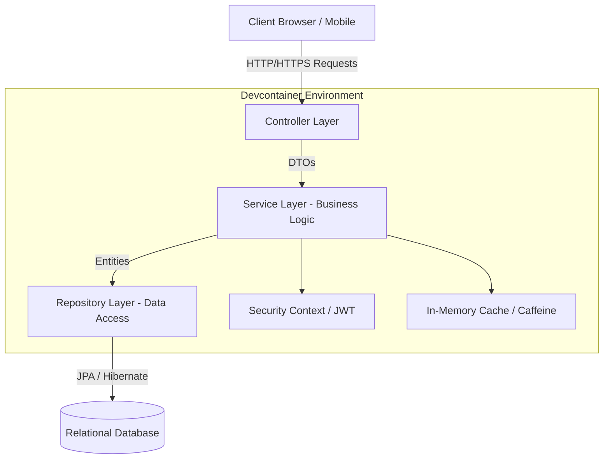

# Portfólio de Desenvolvimento Backend
🌎 *[Click here for the English version / Clique aqui para a versão em inglês](#english-version)*

# 🏢 Hierarchical Team Management System

> **Status:** Em Produção | **Arquitetura:** Layered Architecture | **Ambiente:** Devcontainers (Docker)

Este projeto é um sistema robusto de gestão hierárquica de equipes, desenvolvido para suportar controle de acessos em múltiplos níveis, dashboards analíticos e renderização de mapas interativos. A aplicação foi projetada com foco em alta performance, segurança e manutenibilidade, abstraindo a complexidade de regras de negócio em um design limpo e escalável.

---

## 🏗 Visão Geral e Arquitetura

O sistema implementa uma **Arquitetura em Camadas (Layered Architecture)** clássica, separando claramente as responsabilidades de roteamento (Controllers), lógica de negócios (Services) e persistência de dados (Repositories). Essa abordagem garante que o sistema seja testável e que as regras de domínio não vazem para as camadas de apresentação.

Para garantir paridade absoluta entre os ambientes de desenvolvimento e produção, toda a stack de desenvolvimento foi encapsulada utilizando **Devcontainers** e Docker Compose. Isso elimina a clássica síndrome de "na minha máquina funciona", isolando dependências (banco de dados, cache, backend) e padronizando o ambiente para qualquer membro da equipe de engenharia.

### Fluxo da Arquitetura



---

## 🚀 Destaques Técnicos

### 1. Otimização de Payload Geográfico (GeoJSON)

Um dos maiores desafios do projeto foi o processamento e envio de dados geoespaciais (shapes de mapas em GeoJSON) para os dashboards interativos. O payload original de fronteiras continha mais de 62.000 linhas, causando latência severa nas requisições.

A solução foi implementada em três frentes arquiteturais:
1. **Cache em Memória (Server-side):** Ao invés de consultar e desserializar o arquivo em cada requisição, os shapes são carregados em um mapa estático (`HashMap` / Caffeine) em tempo de inicialização da aplicação.
2. **Compressão GZip:** Ativada no nível da aplicação/servidor, reduzindo drasticamente o tráfego de rede (de ~350KB para ~80KB por requisição de mapa).
3. **Estratégias de Cache HTTP (Browser-side):** Implementação de cabeçalhos `Cache-Control` nas respostas para evitar que os clientes baixem shapes estáticos repetidamente.

**Snippet Estrutural (Configuração de Memória e HTTP Cache):**

```java
@Service
public class MapShapeManagementService {
    
    // In-Memory cache for fast spatial data retrieval
    private Map<String, Map<String, SpatialDataDTO>> shapesCache = new HashMap<>();
    private final ObjectMapper objectMapper;
    private final Resource spatialResource;

    @PostConstruct
    public void loadSpatialDataToMemory() {
        try (InputStream inputStream = spatialResource.getInputStream()) {
            TypeReference<Map<String, Map<String, SpatialDataDTO>>> typeRef = new TypeReference<>() {};
            this.shapesCache = objectMapper.readValue(inputStream, typeRef);
            log.info("Spatial data successfully loaded into memory.");
        } catch (IOException e) {
            log.error("Failed to load spatial structures", e);
        }
    }
}

@RestController
@RequestMapping("/api/v1/maps")
public class MapController {

    @GetMapping("/shapes/{regionId}")
    public ResponseEntity<SpatialResponseDTO> getRegionShapes(@PathVariable Long regionId) {
        SpatialResponseDTO response = mapIntegrationService.getRegionShapes(regionId);
        
        // Leveraging HTTP Browser Cache to prevent redundant downloads of heavy spatial data
        return ResponseEntity.ok()
            .cacheControl(CacheControl.maxAge(30, TimeUnit.DAYS))
            .body(response);
    }
}
```

### 2. Segurança e SOLID na Divisão de Camadas (Autenticação JWT)

Para o controle hierárquico de acessos (`ManagementNode`, `TeamMember`, `Admin`), adotamos o padrão **JWT (JSON Web Tokens)**. 

Para manter os Controllers limpos e não inflar os Services com dependências diretas de autenticação, o Princípio da Responsabilidade Única (Single Responsibility Principle) e a Inversão de Dependência (Dependency Inversion) do SOLID foram rigorosamente aplicados. 

Foi criado um componente injetável `AuthenticatedContext` que extrai as propriedades do contexto de segurança do Spring, permitindo que a camada de serviço recupere os IDs e regras do usuário de forma transparente, sem violar a pureza arquitetural.

**Snippet Estrutural (Contexto de Segurança Isolado):**

```java
@Component
public class AuthenticatedContext {

    private DecodedJWT getDecodedToken() {
        Authentication auth = SecurityContextHolder.getContext().getAuthentication();
        if (auth == null || auth.getDetails() == null) {
            throw new UnauthorizedException("No security context found.");
        }
        return (DecodedJWT) auth.getDetails();
    }

    public Long getActiveUserId() {
        DecodedJWT token = getDecodedToken();
        String tokenType = token.getClaim("tokenType").asString();

        if ("FULL_ACCESS".equals(tokenType)) {
            return token.getClaim("userId").asLong();
        }
        
        if ("RESTRICTED".equals(tokenType)) {
            // Complex resolution logic abstracted away from the Service layer
            return extractRestrictedId(token);
        }

        throw new IllegalArgumentException("Unknown token structure.");
    }
}
```

### 3. Documentação e Contratos de API (Swagger / OpenAPI)

Toda a superfície de comunicação da API foi mapeada utilizando **Swagger (OpenAPI 3)**. A padronização dos contratos garante que a equipe de front-end ou integradores externos compreendam perfeitamente os DTOs de entrada e saída, requisitos de cabeçalho (tokens) e tipos de retorno, reduzindo o tempo de integração e comunicação entre times de engenharia.

---

<br>
<br>

<a id="english-version"></a>
[🇧🇷 Leia em Português](#)

# 🏢 Hierarchical Team Management System

> **Status:** Production | **Architecture:** Layered Architecture | **Environment:** Devcontainers (Docker)

This project is a robust hierarchical team management system designed to support multi-level access controls, analytical dashboards, and interactive map rendering. The application is built with a focus on high performance, security, and maintainability, abstracting complex business rules into a clean and scalable design.

---

## 🏗 Overview and Architecture

The system implements a classic **Layered Architecture**, strictly separating routing responsibilities (Controllers), business logic (Services), and data persistence (Repositories). This approach ensures that the system remains highly testable and prevents domain rules from leaking into the presentation layer.

To guarantee absolute parity between development and production environments, the entire engineering stack was containerized using **Devcontainers** and Docker Compose. This effectively eliminates the "it works on my machine" syndrome, isolating dependencies (databases, caching, backend) and standardizing the workspace for any team member.

### Architecture Flow


---

## 🚀 Technical Highlights

### 1. Geographic Payload Optimization (GeoJSON)

One of the project's most significant bottlenecks was processing and transmitting geospatial data (GeoJSON map shapes) to interactive dashboards. The original boundary payload exceeded 62,000 lines, causing severe network latency.

We resolved this architecturally across three fronts:
1. **In-Memory Cache (Server-side):** Instead of parsing the massive file on every request, the shapes are hydrated into a static map (`HashMap` / Caffeine pattern) at application startup via Jackson.
2. **GZip Compression:** Enabled at the application/server level, drastically shrinking the network footprint (from ~350KB down to ~80KB per map request).
3. **HTTP Caching Strategies (Browser-side):** Implemented strict `Cache-Control` headers, preventing clients from repeatedly downloading immutable static shapes.

**Structural Snippet (Memory and HTTP Cache Configuration):**

```java
@Service
public class MapShapeManagementService {
    
    // In-Memory cache for fast spatial data retrieval
    private Map<String, Map<String, SpatialDataDTO>> shapesCache = new HashMap<>();
    private final ObjectMapper objectMapper;
    private final Resource spatialResource;

    @PostConstruct
    public void loadSpatialDataToMemory() {
        try (InputStream inputStream = spatialResource.getInputStream()) {
            TypeReference<Map<String, Map<String, SpatialDataDTO>>> typeRef = new TypeReference<>() {};
            this.shapesCache = objectMapper.readValue(inputStream, typeRef);
            log.info("Spatial data successfully loaded into memory.");
        } catch (IOException e) {
            log.error("Failed to load spatial structures", e);
        }
    }
}

@RestController
@RequestMapping("/api/v1/maps")
public class MapController {

    @GetMapping("/shapes/{regionId}")
    public ResponseEntity<SpatialResponseDTO> getRegionShapes(@PathVariable Long regionId) {
        SpatialResponseDTO response = mapIntegrationService.getRegionShapes(regionId);
        
        // Leveraging HTTP Browser Cache to prevent redundant downloads of heavy spatial data
        return ResponseEntity.ok()
            .cacheControl(CacheControl.maxAge(30, TimeUnit.DAYS))
            .body(response);
    }
}
```

### 2. Security and SOLID Principles (JWT Authentication)

To handle hierarchical access controls (`ManagementNode`, `TeamMember`, `Admin`), we rely on **JWT (JSON Web Tokens)**.

To keep Controllers lean and prevent Services from bloating with direct security context dependencies, SOLID's Single Responsibility and Dependency Inversion principles were strictly followed.

We built an injectable `AuthenticatedContext` component. It extracts security context properties directly from the framework's holding strategy, allowing the Service layer to transparently fetch user IDs and roles without breaking architectural purity.

**Structural Snippet (Isolated Security Context):**

```java
@Component
public class AuthenticatedContext {

    private DecodedJWT getDecodedToken() {
        Authentication auth = SecurityContextHolder.getContext().getAuthentication();
        if (auth == null || auth.getDetails() == null) {
            throw new UnauthorizedException("No security context found.");
        }
        return (DecodedJWT) auth.getDetails();
    }

    public Long getActiveUserId() {
        DecodedJWT token = getDecodedToken();
        String tokenType = token.getClaim("tokenType").asString();

        if ("FULL_ACCESS".equals(tokenType)) {
            return token.getClaim("userId").asLong();
        }
        
        if ("RESTRICTED".equals(tokenType)) {
            // Complex resolution logic abstracted away from the Service layer
            return extractRestrictedId(token);
        }

        throw new IllegalArgumentException("Unknown token structure.");
    }
}
```

### 3. API Contracts and Documentation (Swagger / OpenAPI)

The entire API surface is mapped using **Swagger (OpenAPI 3)**. Standardizing these contracts ensures frontend teams or external integrators perfectly understand input/output DTOs, header requirements (tokens), and return structures, effectively eliminating integration friction and communication overhead.
