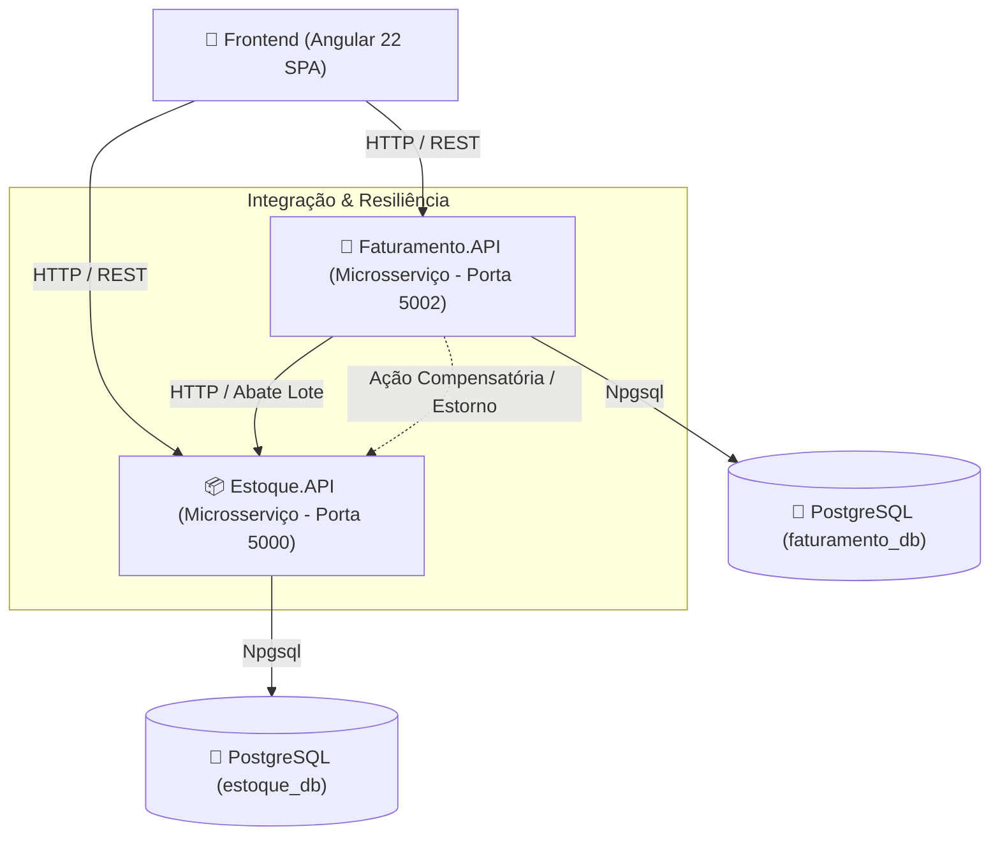

# Sistema de Gestão de Estoque e Faturamento

[](https://dotnet.microsoft.com/)
[](https://www.postgresql.org/)
[](https://angular.dev/)
[](https://xunit.net/)
[](https://www.docker.com/)

> **Projeto de Desafio Técnico / Portfólio de Engenharia de Software**  
> **Desenvolvedor:** Carlos Hygor  
> **Objetivo:** Solução distribuída em **Arquitetura de Microsserviços** desacoplada para controle de estoque e faturamento de notas fiscais, combinando **ASP.NET Core 8**, **Entity Framework Core**, **PostgreSQL**, **Angular 22** e uma suíte rigorosa de **Testes Automatizados (67 testes aprovados: 43 C# + 24 Vitest)**.

---

## 🏛️ Arquitetura da Solução

O sistema foi desenhado seguindo princípios de **Microsserviços**, **Clean Architecture**, **SOLID** e **Tratamento de Falhas Distribuídas**:



---

## 🧠 Decisões de Arquitetura & Trade-offs (Architectural Decision Records)

Nesta seção estão documentadas as decisões técnicas tomadas durante a concepção do sistema, registrando o racional de engenharia, prós e contras de produto:

### 1. ⚡ Caching Distribuído (Redis vs. Consultas Indexadas no PostgreSQL)

- **Contexto:** Avaliação da inclusão de camada de Cache (ex: Redis) para os endpoints de consulta paginada (`GET /api/produtos` e `GET /api/notasfiscais`).
- **Decisão:** Opção por consultas indexadas diretamente no banco relacional PostgreSQL, sem adição de camada de cache em memória.
- **Racional de Engenharia:**
  - **Mutações Frequentes & Taxa de Invalidação:** A impressão de Notas Fiscais altera saldos de produtos constantemente. Em estratégias de _Cache-Aside_, essa mutação constante exigiria invalidações frequentes (_Cache Eviction_) de chaves de paginação e busca, reduzindo o _Cache Hit Rate_ e tornando o cache ineficaz.
  - **Garantia de Consistência Forte (ACID):** O domínio exige que o usuário veja imediatamente o saldo real do produto após a impressão de uma nota fiscal, evitando dados obsoletos (_stale data_).
  - **Evitando Otimização Precoce (KISS / YAGNI):** As tabelas no PostgreSQL utilizam índices dedicados nas colunas de ordenação e busca, respondendo em sub-milissegundos (< 5ms) para a volumetria pretendida sem adicionar a complexidade operacional de infraestrutura do Redis.

### 2. 🔑 Garantia de Idempotência e Padrão Saga na Integração de Microsserviços

- **Contexto:** Prevenção de duplo abate de estoque em cenários de falha de rede (_Timeout_ / _Retries_) durante a impressão de Notas Fiscais entre `Faturamento.API` e `Estoque.API`.
- **Decisão:** Implementar a tabela `processamentos_idempotentes` e suporte a `IdempotencyKey` no endpoint `POST /api/produtos/abater-lote`.
- **Racional de Engenharia:**
  - **Desafios de Redes Instáveis:** Se o `Estoque.API` abater o saldo com sucesso, mas o pacote de resposta HTTP cair por _Timeout_ de rede, o `Faturamento.API` não sabe se a operação foi concluída e tenta um _Retry_.
  - **Deduplicação de Comandos:** O `Estoque.API` verifica se a `IdempotencyKey` (ex: `NF-0001`) já foi processada. Em caso positivo, retorna HTTP 200 OK sem descontar o saldo uma segunda vez (`saldo -= N`).
  - **Ação Compensatória (Saga):** Se o banco do Faturamento falhar após o abate no Estoque, o sistema dispara o estorno atômico em lote (`EstornarEstoqueLoteAsync`).

### 3. 🛡️ Tratamento de Concorrência e Prevenção de Overbooking (Defense in Depth)

- **Contexto:** Garantir que quando dois usuários/notas tentarem abater o último item de um produto simultaneamente (Saldo = 1), o sistema impeça o abate duplicado (_Overbooking_ / Saldo Negativo).
- **Decisão:** Arquitetura de Proteção em 3 Camadas (_Defense in Depth_): _Pessimistic Row-Level Locking_ nativo do PostgreSQL + Validação na Camada de Aplicação C# + _Check Constraint_ física relacional (`CK_produtos_saldo`).
- **Racional de Engenharia:**
  - **Lock Pessimista de Linha:** Em transações `BeginTransactionAsync()`, o PostgreSQL bloqueia a linha do produto alterado. O segundo processo aguarda a liberação e lê o saldo re-atualizado (0).
  - **Validação de Aplicação & Trava Física no Banco:** A aplicação barra o saldo insuficiente com `EstoqueInsuficienteException` (HTTP 422). Além disso, a constraint relacional `"Saldo" >= 0` impede fisicamente no banco qualquer inconsistência.

---

## 🛠️ Status dos Módulos & Destaques de Engenharia

### 1. 📦 Microsserviço de Estoque (`Estoque.API`) — Status: ✅ Concluído

Responsável pelo cadastro de produtos, controle de saldos, baixa em lote atômica e estornos de estoque.

#### 💡 Destaques de Engenharia:

- **DTOs Imutáveis (`C# record`)**: Transporte de dados com validações `Data Annotations` (`[Required]`, `[Range]`, `[StringLength]`).
- **Mapeamento de Alta Performance (`ProdutoMapper`)**: Extension Methods estáticos isolando a conversão DTO $\leftrightarrow$ Entidade, mantendo as Controllers limpas (Single Responsibility Principle).
- **Defesa em Profundidade (_Defense in Depth_)**:
  - Validação na aplicação C# (`Saldo >= 0`).
  - **Check Constraint física no PostgreSQL** (`CK_produtos_saldo` $\rightarrow$ `"Saldo" >= 0`) via EF Core.
- **Transação Atômica Relacional (Tudo ou Nada)**: O método `AbaterEstoqueLoteAsync` executa o abate de múltiplos produtos utilizando `BeginTransactionAsync()`. Caso qualquer item falhe ou tenha saldo insuficiente, a transação sofre `Rollback` automático.
- **Tratamento Global de Exceções (`IExceptionHandler`)**:
  - `GlobalExceptionHandler` intercepta exceções no pipeline do .NET 8.
  - Exceções de domínio dedicadas: `ProdutoNaoEncontradoException` (404), `CodigoProdutoDuplicadoException` (409) e `EstoqueInsuficienteException` (422).
- **Modularização do `Program.cs`**: Injeção de dependência e políticas de CORS isoladas em `Extension Methods` (`CorsSetup`, `DependencyInjectionSetup`).
- **Suíte de Testes Automatizados (21 Testes - 100% Passando em < 1s)**:
  - Testes Unitários de Regra de Negócio com `xUnit`, `Moq` e `FluentAssertions`.
  - Testes de Transação Atômica Real utilizando `SQLite In-Memory` com suporte a `Rollback`.
  - Testes E2E HTTP via `WebApplicationFactory<Program>`.

---

### 2. 📜 Microsserviço de Faturamento (`Faturamento.API`) — Status: ✅ Concluído

Responsável pela criação de Notas Fiscais com numeração sequencial automática e orquestração de impressão com abate de estoque.

#### 💡 Destaques de Engenharia:

- **Integração Distribuída (`EstoqueClient`)**: Comunicação via `HttpClientFactory` resiliente chamando a API de Estoque para baixa de lote atômica.
- **Resiliência & Padrão Saga (Ação Compensatória)**:
  - Ao imprimir uma Nota Fiscal (`Status` Aberta $\rightarrow$ Fechada), a API solicita o abate de lote ao `Estoque.API`.
  - Se a baixa no estoque for confirmada, mas a gravação final do status na base do Faturamento falhar (ex: erro de banco), a API aciona automaticamente a **Ação Compensatória** (`EstornarEstoqueLoteAsync`) no `Estoque.API` para devolver o saldo dos produtos e manter a consistência entre os microsserviços.
- **Máquina de Estados & Regras de Negócio**:
  - Notas Fiscais iniciam com status `Aberta`.
  - Impedimento de exclusão ou alteração de notas com status `Fechada`.
  - Numeração sequencial gerada automaticamente por transação.
- **Tratamento Global de Exceções (`IExceptionHandler`)**:
  - Exceções de domínio dedicadas: `NotaFiscalNaoEncontradaException` (404), `NotaFiscalStatusInvalidoException` (400) e `ServicoEstoqueIndisponivelException` (503).
- **Suíte de Testes Automatizados (16 Testes - 100% Passando em < 1s)**:
  - Testes Unitários cobrindo o fluxo de criação, impressão, Ação Compensatória e validações de estado.
  - Testes E2E HTTP com simulação de integração via `Mock<IEstoqueClient>` e `WebApplicationFactory<Program>`.

---

### 3. 💻 Frontend Web (`frontend`) — Status: ✅ Concluído

Interface SPA moderna em **Angular 22** projetada para alta produtividade operacional (PDV/ERP), integrada diretamente aos dois microsserviços C# .NET 8.

#### 💡 Destaques de Engenharia & Arquitetura Frontend:

- **Arquitetura de Standalone Components**: Estrutura modular limpa sem `NgModule`, utilizando componentes isolados e consumo reativo de APIs REST via RxJS (`HttpClient`, `pipe`, `finalize`).
- **Design System KORP ERP (Theme)**: Layout responsivo em modo escuro (`#12222a` / `#1a2f3a`), padronização visual das tabelas, indicador de APIs no rodapé e barra de ferramentas em 2 linhas.
- **♿ Recursos de Acessibilidade Web (WCAG 2.2 Level AAA)**:
  - **🤟 Widget Oficial VLibras**: Tradução nativa para Língua Brasileira de Sinais via avatar 3D do Governo Federal.
  - **🔤 Redimensionamento de Fonte (`A-`, `A`, `A+`)**: Controle da escala de fonte no `html` de 85% até 130%.
  - **👁️ Modo Alto Contraste**: Alternância instantânea via CSS Custom Properties (`:root` -> `.high-contrast`) com ícone SVG vetorizado da W3C.
  - **⌨️ Anéis de Foco de Teclado**: Suporte a navegação completa por `Tab` e `Shift+Tab` via `:focus-visible`.
- **Módulo de Estoque (Produtos)**:
  - Tabela paginada com seletor de itens por página (5, 10, 20).
  - **Busca em Tempo Real com Debounce (350ms)**: Busca por código ou descrição usando RxJS `Subject<string>` com `debounceTime(350)` e `distinctUntilChanged()`.
  - Ordenação dinâmica por saldo (Maior / Menor Saldo Primeiro).
  - Formulário reativo de cadastro e edição de produtos.
  - Confirmação de exclusão com tratamento de conflito de código duplicado (HTTP 409).
- **Módulo de Faturamento (Notas Fiscais)**:
  - Tabela paginada de notas fiscais com numeração sequencial formatada (`<code>#0001</code>`).
  - Filtro por abas de status (`Todas`, `Abertas`, `Fechadas`).
  - **Ordenação Flexível**: Ordenação por data de emissão ou quantidade de itens (`data_asc`, `data_desc`, `itens_asc`, `itens_desc`).
  - Accordion expansível por linha para visualização dos itens vinculados à nota fiscal.
  - Modal de cadastro reativo com **`FormArray`** dinâmico para adição e remoção de múltiplos produtos.
  - **UX Defensiva**: Seletor que desabilita itens sem estoque (`saldo == 0`), card rico de detalhes do produto selecionado (código, descrição completa e saldo) e trava no botão de adição até preenchimento do item atual.
- **Tratamento de Erros & Resiliência Distribuída no Client**:
  - **HTTP 200 OK**: Transição da nota para `Fechada` + baixa no estoque físico + recarga automática dos saldos.
  - **HTTP 503 Service Unavailable (Estoque Offline)**: Captura e exibição de modal de **Aviso de Resiliência (⚡)** informando que a nota permaneceu **ABERTA** para tentar novamente assim que o serviço estabilizar.
  - **HTTP 422 Unprocessable Entity (Saldo Insuficiente)**: Exibição de modal com tabela explicativa do código do produto, saldo no banco e quantidade solicitada.
- **Suíte de Testes Unitários Frontend (Vitest + AnalogJS)**:
  - Testes cobrindo componentes de tela, validação reativa de formulários, paginação, regras de saldo e modais de erro.

---

## 🔐 Gestão de Secrets & Configurações de Ambiente

A aplicação segue a **Cadeia Hierárquica de Configurações do .NET 8**:

1. **Zero-Friction Onboarding (Avaliação Técnica Local)**:
   - Os arquivos `appsettings.json` contêm valores padrões pré-configurados para que avaliadores e recrutadores possam rodar a aplicação imediatamente (`dotnet run` / `docker-compose`) sem necessidade de criar arquivos `.env` ou configurar variáveis manualmente.
2. **Ambiente de Produção / CI/CD**:
   - Em produção, credenciais de banco de dados e URLs de microsserviços são injetadas via **Variáveis de Ambiente** utilizando o separador `__` (duplo underline):
     - `ConnectionStrings__EstoqueConnection="Server=prod-db;..."`
     - `ConnectionStrings__FaturamentoConnection="Server=prod-db;..."`
     - `Services__EstoqueUrl="http://estoque-api-prod:5000"`
3. **Desenvolvimento Seguro Local (`.NET User Secrets`)**:
   - Para evitar commitar credenciais locais no Git:
     ```bash
     dotnet user-secrets set "ConnectionStrings:EstoqueConnection" "Host=...;Database=...;Username=...;Password=..."
     ```

---

## 🧪 Como Executar a Suíte Completa de Testes (65 Testes Aprovados)

### 1. Testes do Backend (C# / .NET 8 xUnit) — 41 Testes

```bash
dotnet test backend/Estoque.API.Tests/Estoque.API.Tests.csproj && dotnet test backend/Faturamento.API.Tests/Faturamento.API.Tests.csproj
```

**Resultado:**

- `Estoque.API.Tests`: **23/23 Aprovados**
- `Faturamento.API.Tests`: **18/18 Aprovados**

### 2. Testes do Frontend (Angular 22 / Vitest) — 24 Testes

```bash
cd frontend && npm test
```

**Resultado:**

- `6 arquivos .spec.ts`: **24/24 Aprovados**

---

## 🚀 Como Rodar os Microsserviços Localmente

### 1. Requisitos

- .NET 8 SDK
- Docker & Dev Container (ou PostgreSQL 16 rodando localmente)

### 2. Executar o Microsserviço de Estoque (`Estoque.API`)

```bash
dotnet run --project backend/Estoque.API/Estoque.API.csproj
```

- **Swagger UI**: `http://localhost:5000/swagger`
- **Health Check**: `http://localhost:5000/health`

### 3. Executar o Microsserviço de Faturamento (`Faturamento.API`)

Em outro terminal:

```bash
dotnet run --project backend/Faturamento.API/Faturamento.API.csproj
```

- **Swagger UI**: `http://localhost:5002/swagger`
- **Health Check**: `http://localhost:5002/health`

---

## 📬 Tabela Completa de Endpoints HTTP

### 📦 Estoque API (`Estoque.API` - Porta 5000)

| Método       | Endpoint                        | Descrição                                                                                         | Status HTTP                                         |
| :----------- | :------------------------------ | :------------------------------------------------------------------------------------------------ | :-------------------------------------------------- |
| **`GET`**    | `/health`                       | Health Check nativo de disponibilidade                                                            | `200 OK`                                            |
| **`GET`**    | `/api/produtos`                 | Lista paginada com busca por código/descrição (`busca`) e ordenação por saldo (`ordenarPorSaldo`) | `200 OK`                                            |
| **`GET`**    | `/api/produtos/{id}`            | Detalhes do produto por ID                                                                        | `200 OK`, `404 NotFound`                            |
| **`GET`**    | `/api/produtos/codigo/{codigo}` | Detalhes do produto por Código                                                                    | `200 OK`, `404 NotFound`                            |
| **`POST`**   | `/api/produtos`                 | Cadastra um novo produto                                                                          | `201 Created`, `400 BadRequest`, `409 Conflict`     |
| **`PUT`**    | `/api/produtos/{id}`            | Atualiza dados de um produto                                                                      | `204 NoContent`, `404 NotFound`, `409 Conflict`     |
| **`DELETE`** | `/api/produtos/{id}`            | Remove um produto do estoque                                                                      | `204 NoContent`, `404 NotFound`                     |
| **`POST`**   | `/api/produtos/{codigo}/abater` | Abate quantidade individual                                                                       | `200 OK`, `422 UnprocessableEntity`, `404 NotFound` |
| **`POST`**   | `/api/produtos/abater-lote`     | Abate atômico de múltiplos produtos em lote                                                       | `200 OK`, `422 UnprocessableEntity`, `404 NotFound` |
| **`POST`**   | `/api/produtos/estornar-lote`   | Reverte/Estorna lote de produtos (Ação Compensatória)                                             | `200 OK`, `400 BadRequest`                          |

### 📜 Faturamento API (`Faturamento.API` - Porta 5002)

| Método       | Endpoint                            | Descrição                                                                                 | Status HTTP                                                          |
| :----------- | :---------------------------------- | :---------------------------------------------------------------------------------------- | :------------------------------------------------------------------- |
| **`GET`**    | `/health`                           | Health Check nativo de disponibilidade                                                    | `200 OK`                                                             |
| **`GET`**    | `/api/notasfiscais`                 | Lista paginada com filtro por `status` e ordenação por data ou qtd de itens (`ordenacao`) | `200 OK`                                                             |
| **`GET`**    | `/api/notasfiscais/{id}`            | Detalhes da Nota Fiscal por ID                                                            | `200 OK`, `404 NotFound`                                             |
| **`GET`**    | `/api/notasfiscais/numeracao/{num}` | Busca Nota Fiscal por numeração sequencial                                                | `200 OK`, `404 NotFound`                                             |
| **`POST`**   | `/api/notasfiscais`                 | Cria Nota Fiscal com status inicial `Aberta`                                              | `201 Created`, `400 BadRequest`                                      |
| **`POST`**   | `/api/notasfiscais/{id}/imprimir`   | Imprime Nota, abate estoque e altera status para `Fechada`                                | `200 OK`, `400 BadRequest`, `404 NotFound`, `503 ServiceUnavailable` |
| **`DELETE`** | `/api/notasfiscais/{id}`            | Remove Nota Fiscal (apenas no status `Aberta`)                                            | `204 NoContent`, `400 BadRequest`, `404 NotFound`                    |

---

## ✒️ Licença e Autoria

Desenvolvido por **Carlos Hygor** como solução do desafio técnico e portfólio prático de engenharia de software em ecossistema .NET e Angular.
